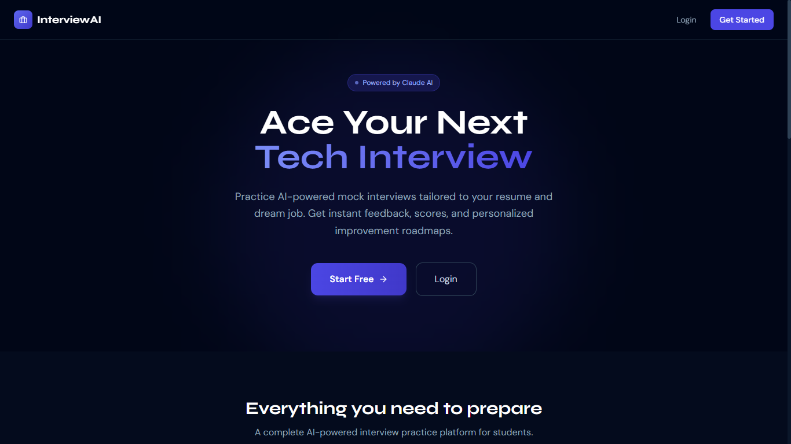
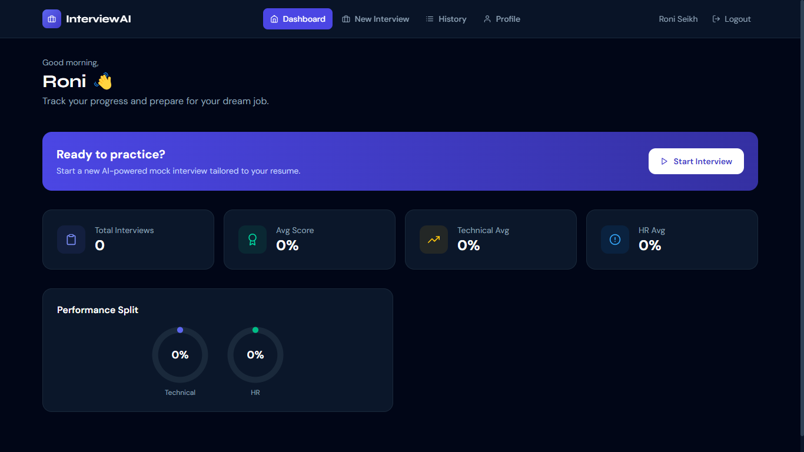
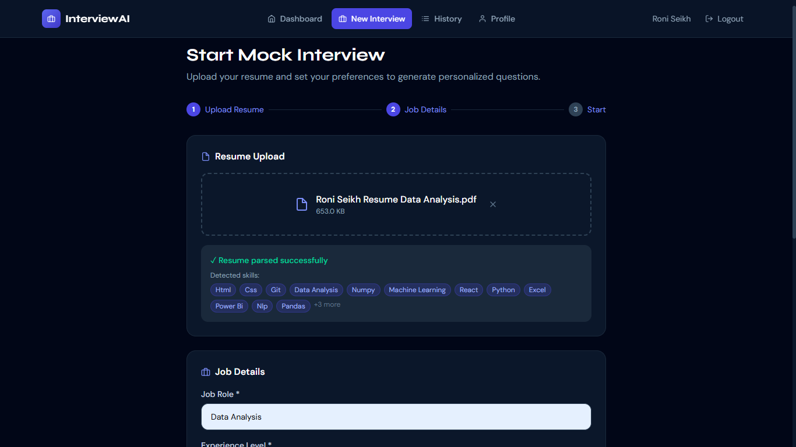
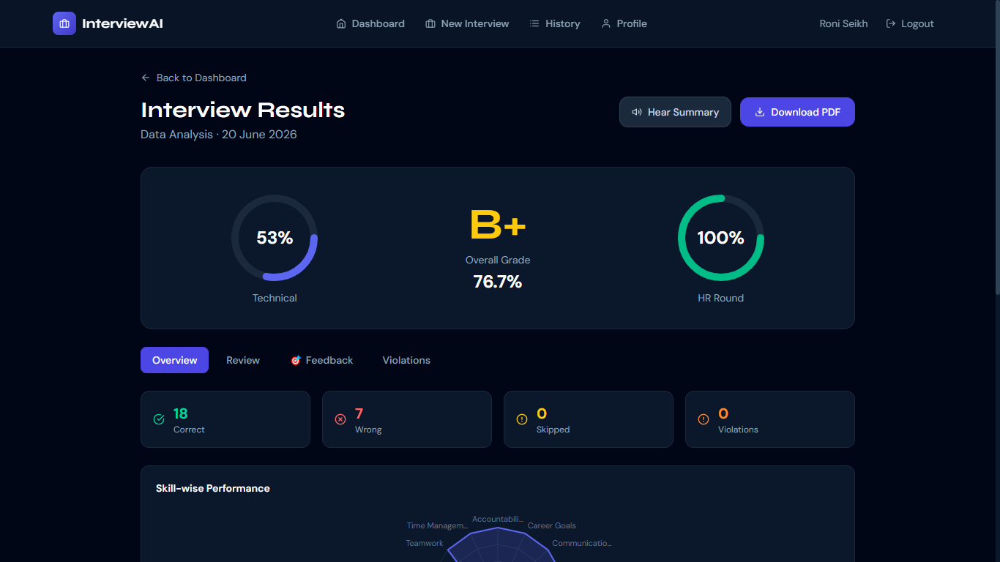
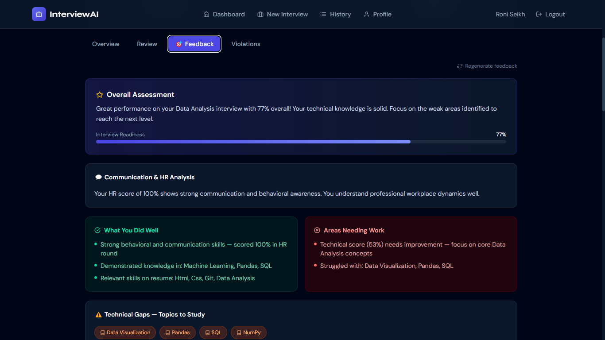
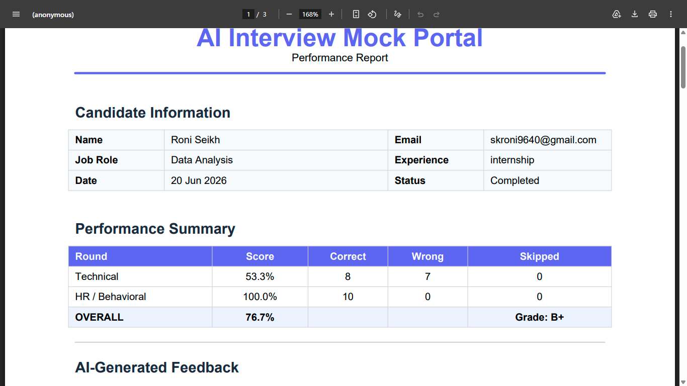
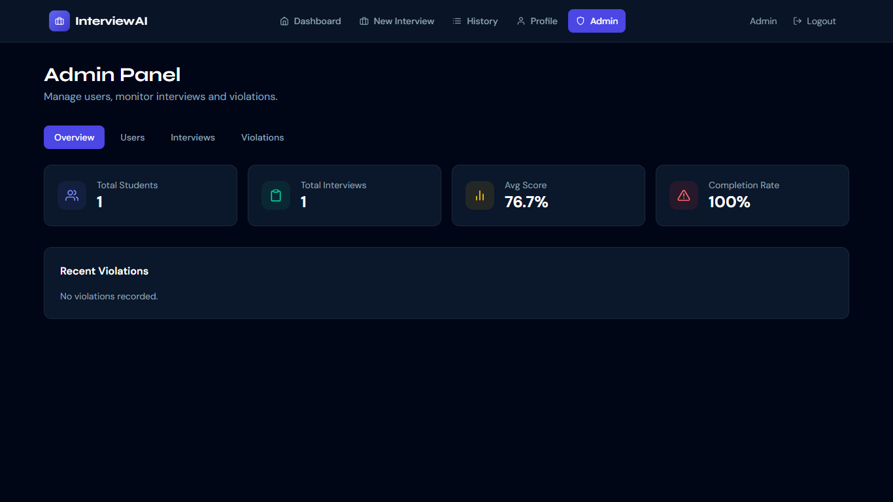
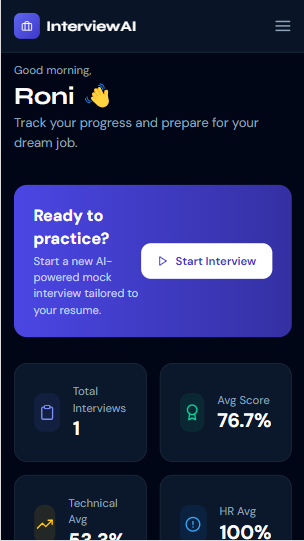

<div align="center">

# 🎯 AI Resume Interview Mock Portal

### AI-Powered Mock Interview Platform for Students

[](https://ai-interview-portal-roni.vercel.app/)
[](https://github.com/Roni-Seikh/ai-interview-portal)
[](https://ai-interview-portal-glsm.onrender.com/api/health)
[](https://youtube.com/YOUR_VIDEO_LINK_HERE)

**Practice AI-powered mock interviews tailored to your resume and dream job.  
Get instant feedback, performance analytics, and personalized improvement roadmaps.**

---



</div>

---

## 📋 Table of Contents

- [About the Project](#-about-the-project)
- [Live Links](#-live-links)
- [Screenshots](#-screenshots)
- [Features](#-features)
- [Tech Stack](#-tech-stack)
- [Database Schema](#-database-schema)
- [API Documentation](#-api-documentation)
- [Project Setup](#-project-setup)
- [Deployment Guide](#-deployment-guide)
- [Project Structure](#-project-structure)
- [Environment Variables](#-environment-variables)
- [Author](#-author)

---

## 🚀 About the Project

**AI Resume Interview Mock Portal** is a full-stack web application designed to help students practice mock interviews based on their resume and target job role. The platform uses **Claude AI** to generate personalized interview questions and provides detailed AI-powered feedback after each interview.

### 🎯 What Problem Does It Solve?

Most students struggle with interview preparation because:
- They don't know what questions to expect for their specific skill set
- They have no way to practice under real interview conditions
- They get no structured feedback on their performance
- They don't know which skills are missing from their resume

This platform solves all of these problems with AI.

---

## 🔗 Live Links

| Service | URL |
|---------|-----|
| 🌐 **Live Website** | [https://ai-interview-portal-roni.vercel.app/](https://ai-interview-portal-roni.vercel.app/) |
| 🔌 **Backend API** | [https://ai-interview-portal-glsm.onrender.com/](https://ai-interview-portal-glsm.onrender.com/) |
| 📁 **GitHub Repo** | [https://github.com/Roni-Seikh/ai-interview-portal](https://github.com/Roni-Seikh/ai-interview-portal) |
| 🎥 **YouTube Demo** | [Watch Full Demo Video](https://youtube.com/YOUR_VIDEO_LINK_HERE) |
| 🔌 **API Health** | [https://ai-interview-portal-glsm.onrender.com/api/health](https://ai-interview-portal-glsm.onrender.com/api/health) |

> ⚠️ **Note:** Backend is hosted on Render free tier — first request may take 30–60 seconds to wake up.

---

## 📸 Screenshots

### 🏠 Home Page


### 📊 Dashboard


### 🎤 Interview Screen


### 📈 Results & Analytics


### 🎯 AI Feedback


### 📄 PDF Report


### 🛡️ Admin Panel


### 📱 Mobile View


---

## ✨ Features

### 🔐 Authentication System
- ✅ User registration with **email OTP verification**
- ✅ Secure login with **JWT tokens** (access + refresh)
- ✅ **Remember Me** (30-day session)
- ✅ **Forgot Password** with OTP reset
- ✅ Strong password validation
- ✅ Duplicate email prevention
- ✅ Admin and student roles

### 📊 Dashboard
- ✅ Total interviews taken
- ✅ Average score overview
- ✅ Technical vs HR performance split
- ✅ Score trend line chart
- ✅ Recent interview history
- ✅ Quick start new interview button

### 📄 Resume Analysis
- ✅ Upload **PDF or DOCX** resume (up to 10MB)
- ✅ **NLP-based parsing** extracts:
  - Skills and technologies
  - Projects and experience
  - Education and certifications
- ✅ Resume preview with detected skills

### 🤖 AI Question Generation
- ✅ Questions generated from **resume + job description + experience level**
- ✅ **Role-aware** question pools (Data Science, Frontend, Backend, Full Stack, etc.)
- ✅ **Random seed** ensures unique questions every session
- ✅ Fallback to curated question bank when API unavailable

### 🎤 Interview System
- ✅ **Round 1: Technical MCQs** (15 questions)
- ✅ **Round 2: HR/Behavioral MCQs** (10 questions)
- ✅ **20-second countdown timer** per question
- ✅ **AI Voice** reads questions and options aloud (Web Speech API)
- ✅ Toggle voice on/off during interview
- ✅ Auto-advance when time runs out
- ✅ Skip question option
- ✅ Progress bar showing completion

### 🛡️ Anti-Cheat System
- ✅ **Webcam monitoring** — must stay ON
- ✅ **Tab switch detection** (Browser Visibility API)
- ✅ **Fullscreen enforcement**
- ✅ **Right-click blocked**
- ✅ **Copy/Paste blocked**
- ✅ **Keyboard shortcuts blocked** (F12, Ctrl+Shift+I, PrintScreen, etc.)
- ✅ **Window minimize detection**
- ✅ Violation counter with warnings
- ✅ **Auto-submit after 3 violations**
- ✅ All violations logged in database with timestamps

### 📈 Results & Analytics
- ✅ Technical, HR, and Overall scores with grade (A+ to F)
- ✅ **Skill-wise Radar Chart**
- ✅ **Topic-wise Bar Chart**
- ✅ Full **Q&A review** with correct answers highlighted
- ✅ Time taken per question
- ✅ Violations summary

### 🎯 AI Feedback (7 Sections)
- ✅ **Overall Assessment** with interview readiness score
- ✅ **Communication Analysis** based on HR performance
- ✅ **Strengths** — what the candidate did well
- ✅ **Weaknesses** — specific areas needing work
- ✅ **Technical Gaps** — topics to study
- ✅ **Priority Focus Areas** — High/Medium/Low priority
- ✅ **Missing Resume Skills** — skills absent but needed for the role
- ✅ **Resume Improvements** — actionable suggestions
- ✅ **Learning Resources** — curated links (freeCodeCamp, LeetCode, etc.)
- ✅ **4-Week Study Plan** — week-by-week goals and practice tasks
- ✅ **Interview Tips** — tailored to performance
- ✅ **🔊 Hear Summary** — voice reads entire feedback aloud

### 📄 PDF Report
- ✅ Downloadable PDF containing:
  - Candidate details
  - Performance scores and grade
  - Strengths and weaknesses
  - Technical gaps
  - Resume suggestions
  - Focus areas
  - Weekly study plan
  - Interview tips
  - Violations log
- ✅ Download anytime from History page

### 📚 Interview History
- ✅ View all previous interviews
- ✅ Score delta indicators (↑ improved / ↓ declined)
- ✅ Resume incomplete interviews
- ✅ Filter by status

### 👤 Profile Management
- ✅ Update name and phone
- ✅ Change password (OTP-verified)
- ✅ View account details

### 🛠️ Admin Panel
- ✅ Manage all users (activate/deactivate)
- ✅ View all interviews
- ✅ Monitor all violations
- ✅ Platform analytics overview
- ✅ Add questions to question bank

---

## 🛠️ Tech Stack

### Frontend
| Technology | Purpose |
|-----------|---------|
| **React 18** | UI framework |
| **Tailwind CSS** | Styling |
| **Framer Motion** | Animations |
| **React Router v6** | Client-side routing |
| **Axios** | HTTP client with JWT interceptor |
| **React Hook Form** | Form validation |
| **Recharts** | Charts and graphs |
| **React Hot Toast** | Notifications |
| **React Webcam** | Camera access |
| **Web Speech API** | AI voice reading questions |
| **React Icons** | Icon library |

### Backend
| Technology | Purpose |
|-----------|---------|
| **Python Flask** | REST API framework |
| **Flask-JWT-Extended** | JWT authentication |
| **SQLAlchemy ORM** | Database abstraction |
| **Flask-Mail** | OTP email delivery |
| **Flask-CORS** | Cross-origin resource sharing |
| **Flask-Limiter** | Rate limiting |
| **bcrypt** | Password hashing |
| **pdfplumber** | PDF text extraction |
| **python-docx** | DOCX text extraction |
| **ReportLab** | PDF report generation |
| **Gunicorn** | Production WSGI server |

### Database
| Technology | Purpose |
|-----------|---------|
| **MySQL 8** | Relational database |
| **Clever Cloud** | Hosted MySQL (free tier) |

### AI
| Technology | Purpose |
|-----------|---------|
| **Anthropic Claude API** | Question generation + feedback |
| **Rule-based fallback** | Works without API credits |
| **Web Speech API** | Text-to-speech in browser |

### Hosting
| Service | Purpose |
|---------|---------|
| **Vercel** | React frontend (free forever) |
| **Render** | Flask backend (free tier) |
| **Clever Cloud** | MySQL database (free 10MB) |
| **GitHub** | Source code repository |

---

## 🗄️ Database Schema

The project uses **14 MySQL tables** with proper foreign keys and relationships:

```
users               → Core user accounts (students + admin)
otp_tokens          → Email verification & password reset OTPs
resumes             → Uploaded resume files + parsed data (JSON)
skills              → Global skill library
question_bank       → Admin-managed question pool
interviews          → Interview sessions with scores
interview_questions → Generated MCQ questions per interview
interview_answers   → Student's answers per question
interview_results   → Calculated scores and grade
feedback            → AI-generated feedback (7 sections, JSON)
violations          → Anti-cheat violation log
reports             → Generated PDF report metadata
badges              → Gamification badge definitions
user_badges         → Badges earned by each user
```

### ER Diagram (simplified)
```
users ──────────┬──── resumes ─────── interviews ──┬── interview_questions
                │                          │         └── interview_answers
                │                          ├── interview_results
                │                          ├── feedback
                │                          ├── violations
                └──── user_badges          └── reports
badges ─────────┘
```

---

## 📡 API Documentation

### Base URL
```
Local:      http://localhost:5000/api
Production: https://ai-interview-portal-glsm.onrender.com/api
```

### Authentication Endpoints
| Method | Endpoint | Description | Auth |
|--------|----------|-------------|------|
| POST | `/auth/register` | Register new user | No |
| POST | `/auth/verify-email` | Verify email OTP | No |
| POST | `/auth/resend-otp` | Resend verification OTP | No |
| POST | `/auth/login` | Login → JWT tokens | No |
| POST | `/auth/refresh` | Refresh access token | Refresh token |
| POST | `/auth/forgot-password` | Send password reset OTP | No |
| POST | `/auth/reset-password` | Reset password with OTP | No |
| GET | `/auth/me` | Get current user | ✅ JWT |
| PUT | `/auth/update-profile` | Update name/phone | ✅ JWT |
| GET | `/auth/test-email` | Test SMTP connection | No |
| GET | `/auth/test-claude` | Test Claude API | No |

### Resume Endpoints
| Method | Endpoint | Description | Auth |
|--------|----------|-------------|------|
| POST | `/resume/upload` | Upload + parse resume | ✅ JWT |
| GET | `/resume/list` | List all resumes | ✅ JWT |
| GET | `/resume/:id` | Get specific resume | ✅ JWT |

### Interview Endpoints
| Method | Endpoint | Description | Auth |
|--------|----------|-------------|------|
| POST | `/interview/setup` | Create interview + generate questions | ✅ JWT |
| GET | `/interview/:id/questions/:round` | Get questions (technical/hr) | ✅ JWT |
| POST | `/interview/:id/submit-round` | Submit round answers | ✅ JWT |
| POST | `/interview/:id/complete` | Finalize interview + scores | ✅ JWT |
| POST | `/interview/:id/regenerate-feedback` | Regenerate AI feedback | ✅ JWT |
| POST | `/interview/:id/violation` | Log anti-cheat violation | ✅ JWT |
| GET | `/interview/history` | All interviews for user | ✅ JWT |
| GET | `/interview/:id` | Get interview details | ✅ JWT |

### Results & Reports
| Method | Endpoint | Description | Auth |
|--------|----------|-------------|------|
| GET | `/results/:id` | Full results + Q&A review | ✅ JWT |
| POST | `/reports/generate/:id` | Generate PDF report | ✅ JWT |
| GET | `/reports/download/:id` | Download PDF | ✅ JWT |
| GET | `/reports/list` | List all reports | ✅ JWT |

### Dashboard & Admin
| Method | Endpoint | Description | Auth |
|--------|----------|-------------|------|
| GET | `/dashboard/stats` | Stats + score trend | ✅ JWT |
| GET | `/admin/users` | List all users | ✅ Admin |
| PUT | `/admin/users/:id/toggle` | Activate/deactivate user | ✅ Admin |
| GET | `/admin/interviews` | All interviews | ✅ Admin |
| GET | `/admin/violations` | All violations | ✅ Admin |
| GET | `/admin/analytics` | Platform analytics | ✅ Admin |
| POST | `/admin/questions` | Add to question bank | ✅ Admin |

---

## 💻 Project Setup

### Prerequisites
- Node.js 18+
- Python 3.11+
- MySQL 8.0+ (or XAMPP)
- Git

### 1. Clone the Repository

```bash
git clone https://github.com/Roni-Seikh/ai-interview-portal.git
cd ai-interview-portal
```

### 2. Database Setup

**Using XAMPP (local):**
1. Start XAMPP → Start Apache + MySQL
2. Open phpMyAdmin → `http://localhost/phpmyadmin`
3. Create database: `ai_interview_portal`
4. Click **SQL** tab → paste contents of `database/schema_fixed.sql` → click **Go**

### 3. Backend Setup

```bash
cd backend

# Create virtual environment
python -m venv venv

# Activate (Windows)
venv\Scripts\activate

# Activate (Mac/Linux)
source venv/bin/activate

# Install dependencies
pip install -r requirements.txt

# Create .env file
cp .env.example .env
# Edit .env with your credentials (see Environment Variables section)

# Initialize database
flask --app run init-db

# Create admin user
flask --app run seed-db

# Start backend
python run.py
```

Backend runs at: `http://localhost:5000`

### 4. Frontend Setup

```bash
cd frontend

# Install dependencies
npm install --legacy-peer-deps

# Create .env file
echo "REACT_APP_API_URL=http://localhost:5000/api" > .env

# Start frontend
npm start
```

Frontend runs at: `http://localhost:3000`

### 5. Test the Setup

| Test | URL |
|------|-----|
| API Health | http://localhost:5000/api/health |
| Email Test | http://localhost:5000/api/auth/test-email |
| Claude Test | http://localhost:5000/api/auth/test-claude |
| Frontend | http://localhost:3000 |

### Default Admin Account
```
Email:    admin@portal.com
Password: Admin@1234
```

---

## 🚀 Deployment Guide

### Stack Used for Production
```
Vercel      → React Frontend  (free forever)
Render      → Flask Backend   (free, sleeps after 15min)
Clever Cloud → MySQL Database  (free, 10MB)
```

### Step 1: Push to GitHub
```bash
git init
git add .
git commit -m "Initial commit"
git branch -M main
git remote add origin https://github.com/Roni-Seikh/ai-interview-portal.git
git push -u origin main
```

### Step 2: Database on Clever Cloud
1. Sign up at [clever-cloud.com](https://clever-cloud.com)
2. Create → Add-on → MySQL → DEV plan (free)
3. Open phpMyAdmin → Import `database/schema_fixed.sql`
4. Note: HOST, PORT, DB_NAME, USERNAME, PASSWORD

### Step 3: Backend on Render
1. Sign up at [render.com](https://render.com) with GitHub
2. New → Web Service → Connect repo
3. Settings:
   - **Root Directory:** `backend`
   - **Build Command:** `pip install -r requirements.txt`
   - **Start Command:** `gunicorn -w 2 -b 0.0.0.0:$PORT "run:app"`
   - **Instance:** Free
4. Add all environment variables (see table below)
5. Deploy → note your backend URL

### Step 4: Frontend on Vercel
1. Sign up at [vercel.com](https://vercel.com) with GitHub
2. New Project → Import repo
3. Settings:
   - **Root Directory:** `frontend`
   - **Framework:** Create React App
4. Add environment variable:
   - `REACT_APP_API_URL` = `https://your-backend.onrender.com/api`
5. Deploy → your site is live!

### Step 5: Update CORS
In Render environment variables, update:
```
CORS_ORIGINS = https://your-app.vercel.app
```

---

## 📁 Project Structure

```
ai-interview-portal/
│
├── 📁 frontend/                    # React Application
│   ├── 📁 public/
│   │   ├── index.html
│   │   ├── favicon.ico
│   │   └── manifest.json
│   ├── 📁 src/
│   │   ├── 📁 pages/
│   │   │   ├── HomePage.js         # Public landing page
│   │   │   ├── LoginPage.js        # Login with JWT
│   │   │   ├── RegisterPage.js     # Register + OTP verify
│   │   │   ├── ForgotPasswordPage.js
│   │   │   ├── DashboardPage.js    # Stats + charts
│   │   │   ├── StartInterviewPage.js # Resume upload + job details
│   │   │   ├── InterviewPage.js    # MCQ + timer + webcam + voice
│   │   │   ├── ResultsPage.js      # Analytics + feedback
│   │   │   ├── HistoryPage.js      # Past interviews
│   │   │   ├── ProfilePage.js      # Update profile
│   │   │   └── AdminPage.js        # Admin dashboard
│   │   ├── 📁 components/
│   │   │   └── common/
│   │   │       └── Navbar.js
│   │   ├── 📁 context/
│   │   │   └── AuthContext.js      # JWT + user state
│   │   ├── 📁 services/
│   │   │   └── api.js              # Axios + auto token refresh
│   │   ├── App.js                  # Routes + protected routes
│   │   ├── index.js
│   │   └── index.css               # Tailwind + Google Fonts
│   ├── tailwind.config.js
│   ├── vercel.json
│   └── package.json
│
├── 📁 backend/                     # Flask Application
│   ├── 📁 app/
│   │   ├── __init__.py             # App factory
│   │   ├── config.py               # Dev/Prod/Test configs
│   │   ├── 📁 models/
│   │   │   └── __init__.py         # All SQLAlchemy models (14 tables)
│   │   ├── 📁 routes/
│   │   │   ├── auth.py             # Register, login, OTP
│   │   │   ├── resume.py           # Upload + NLP parse
│   │   │   ├── interview.py        # Setup, questions, submit
│   │   │   ├── results.py          # Results + Q&A review
│   │   │   ├── reports.py          # ReportLab PDF generation
│   │   │   ├── dashboard.py        # Stats + trend data
│   │   │   └── admin.py            # Admin CRUD APIs
│   │   ├── 📁 services/
│   │   │   └── ai_service.py       # Claude API + local fallback
│   │   └── 📁 utils/
│   │       ├── security.py         # bcrypt + validators
│   │       └── validators.py
│   ├── run.py                      # Entry point
│   ├── requirements.txt
│   ├── Procfile                    # For Render
│   ├── runtime.txt                 # Python version
│   └── .env.example
│
├── 📁 database/
│   └── schema_fixed.sql            # Complete MySQL schema
│
└── README.md
```

---

## ⚙️ Environment Variables

### Backend (`backend/.env`)

```env
# Flask
FLASK_ENV=development
SECRET_KEY=your-super-secret-key-change-this
JWT_SECRET_KEY=your-jwt-secret-key-change-this

# MySQL Database (local)
DB_HOST=localhost
DB_PORT=3306
DB_USER=root
DB_PASSWORD=
DB_NAME=ai_interview_portal

# Gmail SMTP (use App Password, NOT your Gmail password)
MAIL_SERVER=smtp.gmail.com
MAIL_PORT=587
MAIL_USERNAME=your-email@gmail.com
MAIL_PASSWORD=your-16-char-app-password

# Frontend URL for CORS
CORS_ORIGINS=http://localhost:3000

# Anthropic Claude AI
ANTHROPIC_API_KEY=sk-ant-api03-...
```

### Frontend (`frontend/.env`)

```env
REACT_APP_API_URL=http://localhost:5000/api
```

### Gmail App Password Setup
1. Go to [myaccount.google.com](https://myaccount.google.com)
2. Security → 2-Step Verification → Enable
3. Search "App passwords" → Create for "Mail"
4. Use the 16-character password in `MAIL_PASSWORD`

---

## 🔒 Security Features

| Feature | Implementation |
|---------|---------------|
| Password Hashing | bcrypt (12 rounds) |
| Authentication | JWT access (1hr) + refresh (30 days) tokens |
| OTP Expiry | 10 minutes for email verify, 15 minutes for password reset |
| Rate Limiting | 10 req/min on register, 20 req/min on login |
| SQL Injection Prevention | SQLAlchemy ORM parameterized queries |
| XSS Protection | React's default output escaping |
| CORS | Restricted to frontend domain only |
| File Upload | Type validation (PDF/DOCX only) + 10MB size limit |
| Input Sanitization | Server-side validation on all endpoints |

---

## 🎮 How to Use

```
1. Register → verify email with OTP
2. Login → lands on Dashboard
3. Click "New Interview"
4. Upload your resume (PDF or DOCX)
5. Enter: Job Role + Job Description + Experience Level
6. System analyzes resume → generates personalized questions
7. Complete Technical Round (15 MCQs, 20 sec each)
8. Complete HR Round (10 MCQs, 20 sec each)
9. View Results → Overview, Q&A Review, Feedback, Violations
10. Download PDF Report
11. Track progress in History
```

---

## 🔮 Future Improvements

- [ ] AI voice interview (speech-to-text answers)
- [ ] Webcam emotion / confidence detection
- [ ] Interview difficulty levels (Easy / Medium / Hard)
- [ ] Leaderboard and gamification badges
- [ ] Email interview reminders
- [ ] Google / GitHub OAuth login
- [ ] Multi-language support
- [ ] Company-specific question packs
- [ ] Interview recording and playback
- [ ] Resume builder integration
- [ ] Peer comparison analytics

---

## 👨‍💻 Author

<div align="center">

**Roni Seikh**

[](https://github.com/Roni-Seikh)
[](https://linkedin.com/in/roniseikh)
[](https://youtube.com/YOUR_VIDEO_LINK_HERE)

</div>

---

## 📄 License

This project is licensed under the **MIT License** — free to use for educational and personal projects.

---

## ⭐ Support

If you found this project helpful, please consider:
- ⭐ **Starring the repository** on GitHub
- 🍴 **Forking** it to build your own version
- 📺 **Watching the demo video** on YouTube
- 🔗 **Sharing** with other students

---

<div align="center">

**Built with ❤️ by Roni Seikh**

[🌐 Live Demo](https://ai-interview-portal-roni.vercel.app/) • [📁 GitHub](https://github.com/Roni-Seikh/ai-interview-portal) • [🎥 YouTube Demo](https://youtube.com/YOUR_VIDEO_LINK_HERE)

</div>
